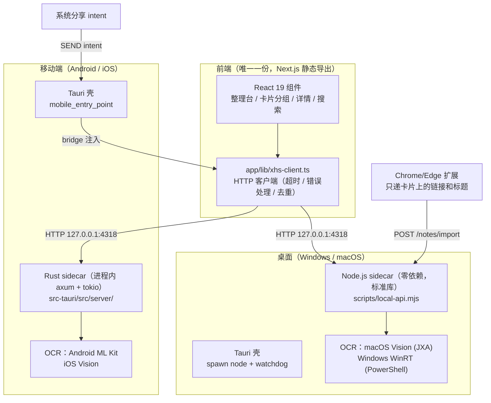
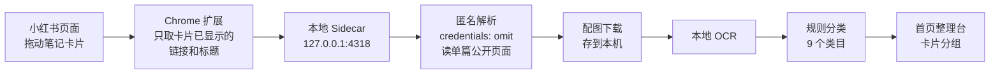

<div align="center">


# 合订本

**专治收藏夹吃灰 —— 把小红书 / B 站你在意的那条内容，抄一份到自己设备上，这次真的找得回来。**


<br /><br />


<sub>收藏进来的笔记按类目摊在整理台上，每个分组是一叠可以展开的卡片</sub>

</div>

---

拖一条笔记（或在小红书 App 里「分享 → 合订本」）进来，本地解析正文、下载配图、跑 OCR 把图里的文字也读出来，然后自动归类到首页。

**不依赖任何爬虫工具，也不用你的账号登录态去发请求。** 解析走的是匿名访问单篇公开页面，一次一条、由你手动触发 —— 不带 Cookie、没有批量抓取、没有定时任务，所以封控风险很低。

数据全程存在你自己的设备上，不上传云端，不需要 AI API key。

## 🤔 为什么做这个

小红书用户自己最常说的一句话就是**收藏夹吃灰** —— 收藏的那一下确实觉得有用，然后就再也没打开过。

但吃灰不全是懒，是收藏夹本身没法用：

- 存了三百条，想找那条讲配色的，翻不到 —— 收藏夹不支持搜正文
- 干货全写在图片里，搜索框对图里的字完全无能
- 笔记被作者删了、被限流了，你的收藏就变成一张灰色占位图
- 想分类得手动建收藏夹，建完也懒得整理

于是「等有空再看」就变成了永远不看。

这个 App 的思路很简单：**把你在意的那几条，抄一份到自己设备上。** 正文、配图、图里的文字，一次性存干净。之后搜关键词就能命中，原帖删了也不影响你 —— 灰就吃不起来了。

## ✨ 能做什么

| | 功能 | 说明 |
|:--:|---|---|
| 🖱️ | **拖拽导入** | 桌面端：从小红书/搜索页把笔记卡片拖进 App 画布 |
| 📲 | **系统分享导入** | Android：小红书 App / 浏览器里「分享 → 合订本」，正文与链接自动入库 |
| 🔍 | **图片文字可搜** | 本地 OCR（macOS Vision / Windows WinRT / Android ML Kit），中英文都认，图里的干货变成可搜索文本 |
| 🧠 | **语义搜索** | 内置 e5 语义模型（int8，282MB，全离线），换种说法也能搜到 |
| 🗂️ | **自动分类** | 按标题、正文、OCR 文本和标签打分，自动分到 9 个类目；纯规则表，改一个文件就能按自己的兴趣调整 |
| 🖼️ | **配图本地化** | 图片下载到本机，原帖删除、限流、防盗链都不影响你已存的内容 |
| 🎬 | **B 站视频入库** | B 站图文/视频解析，视频可下载为本地可播放 mp4 |
| 🤖 | **Agent 可读** | 内置 MCP server，Claude Code / Codex 可以直接搜你的本地笔记库当资料 |
| 🛡️ | **封控风险低** | 不是爬虫，不用你的登录态发请求。不读 Cookie、不登录、不批量、不做后台抓取 |

## 🏗️ 架构（重要，请看这里）

合订本是一套 **Tauri 2 + Next.js** 应用，前端只有一份，桌面和移动端各由一个「本地 sidecar」提供完全相同的 HTTP 契约（`127.0.0.1:4318`）：



### 关键设计决策

**1. 前端零改动跨三端。** 桌面用 Node sidecar（零 npm 依赖、只用标准库，Windows 安装包内置便携 node.exe）；移动端没有 node，就用 Rust 把同一套 API 在进程内重写一遍（axum + tokio）。两边维护同一份 HTTP 契约与错误文案，`app/lib/xhs-client.ts` 不感知平台。移动端前端资源由 `tauri/custom-protocol` 编译期嵌入 `.so` / 可执行文件，不经过 Android assets，`_next` 目录无打包问题。

**2. 匿名解析是唯一入口。** 解析器显式带 `credentials: 'omit'`，失败直接报错，**不会回退到你登录着的浏览器**。每一跳重定向都校验域名白名单（`.xhscdn.com` / `.hdslb.com` / `b23.tv` → `bilibili.com` 等），配图/视频下载同样只认已知 CDN，其他域名直接拒绝。

**3. 数据写入是原子的。** `notes.json` 全部走 temp 文件 + rename，崩溃不会留下半个文件；所有「读 → 改 → 写」都被一个互斥队列/写锁串行化（导入、OCR 回写、删除互相并发不会丢更新）；文件损坏时先备份成 `notes.corrupt-<时间戳>.json` 再继续，绝不静默毁库。

**4. 本地服务有边界。** 只监听 `127.0.0.1`，全路由校验 `Host` 头（防 DNS rebinding）与 `Origin` 白名单（防 CSRF），媒体/模型路由做路径白名单与穿越防护，请求体有 2MB 上限。

### 本地接口（三端一致）

| Method | Path | 作用 |
|---|---|---|
| `GET` | `/health` | 健康检查：数据目录、OCR 引擎与可用性 |
| `GET` | `/notes` | 全部笔记 + 最近导入时间 |
| `POST` | `/notes/import` | 导入一条笔记（拖拽载荷 / 分享文本 / 链接匿名解析） |
| `DELETE` | `/notes/:id` | 删除笔记，连带删除本地配图 |
| `POST` | `/notes/:id/ocr` | OCR 结果回写（Android/iOS 客户端编排） |
| `POST` | `/notes/:id/video/delete` | 删除本地已下载视频（幂等） |
| `GET` | `/media/:noteId/:file` | 读本地配图/视频（支持 Range，视频拖动播放） |
| `GET` | `/models/{path}` | 语义模型文件服务（路径白名单，仅移动端） |
| `GET` | `/setup` | 扩展与 Agent 的安装状态 |
| `POST` | `/setup/browser-extension/open` | 打开扩展配置页（桌面） |
| `POST` | `/setup/agent/connect` | 注册 MCP server（桌面） |

端口可用 `LOCAL_API_PORT` 改，数据目录可用 `LOCAL_APP_DATA_DIR` 改。

### 仓库导览

```
├── app/                    # Next.js 前端（三端共用这一份）
│   ├── components/         #   整理台 / 导入管线 / 设置面板 / 移动端导航
│   └── lib/                #   HTTP 客户端、分享接收、OCR 编排、语义搜索
├── scripts/
│   ├── local-api.mjs       # 桌面 Node sidecar（路由层，零依赖）
│   ├── lib/                #   解析器 / 导入校验 / 媒体下载 / 分类规则（含单测）
│   ├── platform/           #   平台适配（路径、浏览器、Agent 探测）
│   ├── ocr/                #   OCR 门面（Vision / WinRT）
│   └── shoucang-mcp.mjs    # MCP server（只读两个工具）
├── src-tauri/
│   ├── src/lib.rs          # Tauri 入口：桌面 spawn node / 移动端起进程内 sidecar
│   ├── src/server/         # Rust sidecar（axum）：与 Node 侧契约逐一对齐
│   └── gen/android/        # Android 工程（含 MainActivity 分享桥 / OcrBridge / 扩展桥）
├── browser-extension/      # MV3 扩展：host_permissions 仅 127.0.0.1:4318
└── .github/workflows/      # CI（Android APK / iOS 模拟器构建）
```

## 🔄 工作原理



## 🛡️ 为什么不用担心封号

市面上大多数小红书工具是**爬虫思路**：拿你的 Cookie 或扫码登录，然后用你的身份去批量请求接口。这种做法效率高，但风控一来账号就没了 —— 461、471、滑块验证、限流、封禁都是常见结局。

这个项目走的是另一条路：

| | 爬虫工具 | 合订本 |
|---|---|---|
| 身份 | 用你的账号登录态发请求 | **匿名请求，不带 Cookie** |
| 频率 | 批量、定时、自动翻页 | **一次一条，你手动触发才解析** |
| 入口 | 逆向接口 | 你已经打开的那个公开页面 |
| 失败时 | 换 UA、换代理、重试 | **直接报错，不绕验证** |
| 封控风险 | 高 | **很低** |

代码层面都可以核对：

- 解析请求显式写着 `credentials: 'omit'` —— `scripts/lib/anonymous-note-resolver.mjs`
- 图片下载同样不带凭证 —— `scripts/lib/media-import.mjs`
- UA 是 `ShouCangFavorites/0.1 anonymous-local-resolver`，**没有伪装成 Chrome**，平台一看就知道这是谁在请求
- 没有代理池、没有重试退避、没有 UA 轮换 —— 这些爬虫标配一个都没有

**⚠️ B 站解析器的两处边界例外（透明披露）**

小红书解析器全程使用自报 UA（`ShouCangFavorites/0.1 anonymous-local-resolver`），不伪装身份。B 站解析器有两处不同：

| | 小红书 | B 站 |
|---|---|---|
| **User-Agent** | 自报身份，不伪装 | Chrome UA（仅 B 站；B 站拒绝非浏览器 UA，无法匿名解析） |
| **Cookie** | 无 | opus 图文接口携带固定 `buvid3` 匿名指纹（不携带登录态） |

- `buvid3` 是 B 站的设备级匿名指纹（`uuid{hex16}infoc` 格式），每安装生成一次并持久化复用，不携带任何登录态或账号信息
- 这个指纹的存在是 B 站 API 的硬性要求 —— 没有它 opus/detail 接口会返回 412
- B 站解析器同样使用 `credentials: 'omit'`，失败时不会回退到登录浏览器
- 代码位置：`scripts/lib/bilibili-resolver.mjs` / `src-tauri/src/server/bilibili_resolver.rs`

**匿名解析失败时直接抛错，不会回退到你登录着的浏览器** —— 宁可这一条导不进来，也不动你的账号。

> 严格说没有任何第三方工具能承诺 100% 安全。但这里的请求模式和你自己用浏览器点开一篇笔记基本没区别，也不涉及任何账号行为，所以风险很低。

## 🔐 隐私边界（这部分请认真看）

这个项目对「能碰什么」划得很死，因为它处理的是你的浏览记录：

**✅ 会做的**

- 只解析你手动触发的**单条**公开笔记页面
- 匿名 HTTP 请求，不带 Cookie、不带 token（B 站 opus 接口除外，仅携带设备匿名指纹 `buvid3`，无登录态）
- 图片/视频只从已知 CDN 白名单下载（且每一跳重定向都复核域名），其他域名直接拒绝
- 所有数据写在本机目录，服务只监听 `127.0.0.1`，并校验 Host / Origin
- OCR 用系统框架跑，图片不出本机
- AI 分类（可选，桌面）只在检测到 `OPENCODE_GO_API_KEY` 或 `LOCAL_AI_ENV_FILE` 时启用 —— 没有 key 就一次网络请求都不会发

**❌ 不会做的**

- 不读你的小红书/B 站 Cookie 或登录态（B 站 `buvid3` 是设备匿名指纹，非登录态）
- 不访问收藏夹、关注列表、评论接口
- 不做定时任务、后台抓取、批量同步
- 不调用任何远程 AI 服务，**默认不需要 API key**
- 不上传任何数据到任何服务器

**Chrome 扩展的权限清单**（`browser-extension/manifest.json`，可以自己核对）：

```json
"host_permissions": ["http://127.0.0.1:4318/*"]
```

只有本地回环地址一条。**没有 `tabs`、没有 `cookies`、没有 `webRequest`** —— 扩展在技术上就不具备后台开标签页或读取账号凭证的能力，它唯一做的事是把你正在看的这个卡片上已经显示出来的链接和标题，递给本地服务。

## 📦 安装与构建

### Windows / macOS 桌面版

```bash
git clone https://github.com/Jisiyong-A/hedingben.git
cd hedingben
npm install
npm run tauri:build
```

产物在 `src-tauri/target/release/bundle/`。

### Android

```bash
npm run build          # 先产出 dist 静态导出
cd src-tauri
cargo build --target aarch64-linux-android --features tauri/custom-protocol
./gradlew :app:assembleArm64Debug   # src-tauri/gen/android 下
```

> Windows 下 tauri CLI 的 android 子命令有 symlink 与 android-studio-script 两个已知 bug，上面是绕过的全手动流程，详见 `CLAUDE.md`。

### Chrome 扩展（桌面端可选）

1. Chrome 打开 `chrome://extensions`，右上角开启**开发者模式**
2. 点**加载已解压的扩展程序**，选本项目的 `browser-extension/` 目录
3. App 里点「浏览器插件」按钮也会自动帮你打开扩展页和插件文件夹

### 开始用

桌面：打开小红书搜索页，**把笔记卡片拖进 App 窗口的任意位置**。
Android：在小红书 App / 浏览器里点「分享 → 合订本」。

## 🤖 接入 Claude Code / Codex

让 AI 直接查你的收藏当资料：App 里点「连接 Agent」，选 Claude Code 或 Codex，它会自动注册一个 `shoucang-notes` MCP server。手动配置：

```bash
# Claude Code
claude mcp add --scope user shoucang-notes \
  -e "LOCAL_APP_DATA_DIR=$HOME/Library/Application Support/com.patrick.shoucang" \
  -- node /path/to/scripts/shoucang-mcp.mjs

# Codex
codex mcp add shoucang-notes \
  --env "LOCAL_APP_DATA_DIR=$LOCALAPPDATA\\com.patrick.shoucang" \
  -- node /path/to/scripts/shoucang-mcp.mjs
```

提供两个**只读**工具：

| 工具 | 作用 |
|---|---|
| `search_saved_notes` | 搜本地笔记，覆盖标题、正文、图片 OCR、标签、作者、分类 |
| `read_saved_note` | 按 ID 读一条笔记的完整正文和逐图 OCR 文本 |

> 「从我收藏的笔记里找几条讲液态动效的，总结一下实现思路」
> 「我之前收藏过一个 ASCII 风格设计的案例，把原文找出来」

## 🗂️ 自动分类

按标题、正文、OCR 文本、标签加权打分，命中最高的类目胜出，分数不够则留在「待分类」：

`编程开发` · `AI工具` · `阅读思考` · `设计美学` · `旅行户外` · `美食餐饮` · `影像创作` · `方法论` · `生活方式`

规则是纯正则表格，写在 `scripts/lib/category-inference.mjs`，**按自己的兴趣改这个文件就行**，不需要训练也不需要模型。

<div align="center">
  
</div>

## 💾 数据存在哪

```
桌面 (Windows):  %LOCALAPPDATA%\com.patrick.shoucang\
桌面 (macOS):    ~/Library/Application Support/com.patrick.shoucang/
Android:         /data/data/com.patrick.shoucang/
├── notes.json          # 所有笔记的正文、OCR、元数据
├── media/<noteId>/     # 每条笔记的配图 / 视频
└── models/             # 语义模型（移动端）
```

- **备份**：直接拷走这个文件夹
- **彻底删除**：删掉这个文件夹，App 就回到空白状态
- **仓库里不含任何笔记数据**，`.gitignore` 也挡住了，不用担心 commit 的时候把收藏推上去

## 🛠️ 本地开发

```bash
npm install

# 起前端 + 本地服务（两个终端）
npm run dev
npm run local-api

# 或者直接跑桌面版
npm run tauri:dev
```

验证：

```bash
npm test      # node:test 用例（解析器 / 导入链 / 分类 / 平台适配 / OCR）
npm run lint
npm run build
cargo test    # 在 src-tauri/ 下：Rust sidecar 移植 + HTTP 契约 + 集成测试
```

## 🧱 技术栈

- **前端** Next.js 16 · React 19 · Tailwind CSS 4 · Framer Motion
- **桌面** Tauri 2 + Node.js sidecar（零依赖，只用标准库）
- **移动端** Tauri 2 + Rust 进程内 sidecar（axum + tokio）
- **OCR** macOS Vision（JXA）/ Windows WinRT / Android ML Kit / iOS Vision，全部本地
- **语义搜索** e5-base int8（WASM，onnxruntime，全离线）

## ⚠️ 已知限制

- **小红书改版会失效**：扩展的 DOM 选择器和页面状态解析规则依赖当前页面结构，改版后需要跟着更新
- **匿名解析可能失败**：页面拒绝匿名访问时导入会报错。这是设计如此 —— 不会为了成功率去用你的登录态
- **不支持批量**：一次一条，没有收藏夹同步。这也是故意的
- **Android/iOS 语义模型较大**：内置 282MB e5 int8 模型，首启部署需要一点时间
- 桌面 Windows 安装包未签名（SmartScreen 可能提示）

## 📄 License

[AGPL-3.0-or-later](LICENSE)

可以商用，也可以随便改。但如果你**修改后对外分发，或者拿它提供网络服务**，必须以同样的 AGPL 协议公开你的改动源码。

换句话说：欢迎拿去用、拿去改、拿去卖，但不能闭源套壳。
